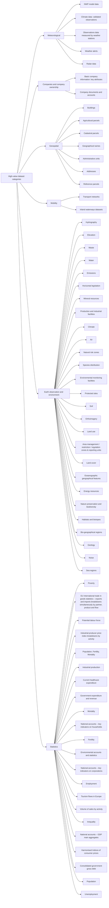

# High-Value Dataset Categories
## Language code: **en**

```mermaid
flowchart LR
http://data.europa.eu/bna/asd487ae75[High-value dataset categories]
click http://data.europa.eu/bna/asd487ae75 href "http://data.europa.eu/bna/asd487ae75"
http://data.europa.eu/bna/asd487ae75-->http://data.europa.eu/bna/c_164e0bf5
http://data.europa.eu/bna/c_164e0bf5["Meteorological"]
click http://data.europa.eu/bna/c_164e0bf5 href "http://data.europa.eu/bna/c_164e0bf5"
http://data.europa.eu/bna/c_164e0bf5-->http://data.europa.eu/bna/c_13e3cf16
http://data.europa.eu/bna/c_13e3cf16["NWP model data"]
click http://data.europa.eu/bna/c_13e3cf16 href "http://data.europa.eu/bna/c_13e3cf16"
http://data.europa.eu/bna/c_164e0bf5-->http://data.europa.eu/bna/c_36807466
http://data.europa.eu/bna/c_36807466["Climate data: validated observations"]
click http://data.europa.eu/bna/c_36807466 href "http://data.europa.eu/bna/c_36807466"
http://data.europa.eu/bna/c_164e0bf5-->http://data.europa.eu/bna/c_3af3368c
http://data.europa.eu/bna/c_3af3368c["Observations data measured by weather stations"]
click http://data.europa.eu/bna/c_3af3368c href "http://data.europa.eu/bna/c_3af3368c"
http://data.europa.eu/bna/c_164e0bf5-->http://data.europa.eu/bna/c_be47b010
http://data.europa.eu/bna/c_be47b010["Weather alerts"]
click http://data.europa.eu/bna/c_be47b010 href "http://data.europa.eu/bna/c_be47b010"
http://data.europa.eu/bna/c_164e0bf5-->http://data.europa.eu/bna/c_d13a4420
http://data.europa.eu/bna/c_d13a4420["Radar data"]
click http://data.europa.eu/bna/c_d13a4420 href "http://data.europa.eu/bna/c_d13a4420"
http://data.europa.eu/bna/asd487ae75-->http://data.europa.eu/bna/c_a9135398
http://data.europa.eu/bna/c_a9135398["Companies and company ownership"]
click http://data.europa.eu/bna/c_a9135398 href "http://data.europa.eu/bna/c_a9135398"
http://data.europa.eu/bna/c_a9135398-->http://data.europa.eu/bna/c_56a1bf47
http://data.europa.eu/bna/c_56a1bf47["Basic company information: key attributes"]
click http://data.europa.eu/bna/c_56a1bf47 href "http://data.europa.eu/bna/c_56a1bf47"
http://data.europa.eu/bna/c_a9135398-->http://data.europa.eu/bna/c_8f0fac04
http://data.europa.eu/bna/c_8f0fac04["Company documents and accounts"]
click http://data.europa.eu/bna/c_8f0fac04 href "http://data.europa.eu/bna/c_8f0fac04"
http://data.europa.eu/bna/asd487ae75-->http://data.europa.eu/bna/c_ac64a52d
http://data.europa.eu/bna/c_ac64a52d["Geospatial"]
click http://data.europa.eu/bna/c_ac64a52d href "http://data.europa.eu/bna/c_ac64a52d"
http://data.europa.eu/bna/c_ac64a52d-->http://data.europa.eu/bna/c_60182062
http://data.europa.eu/bna/c_60182062["Buildings"]
click http://data.europa.eu/bna/c_60182062 href "http://data.europa.eu/bna/c_60182062"
http://data.europa.eu/bna/c_ac64a52d-->http://data.europa.eu/bna/c_642643e6
http://data.europa.eu/bna/c_642643e6["Agricultural parcels"]
click http://data.europa.eu/bna/c_642643e6 href "http://data.europa.eu/bna/c_642643e6"
http://data.europa.eu/bna/c_ac64a52d-->http://data.europa.eu/bna/c_6a3f6896
http://data.europa.eu/bna/c_6a3f6896["Cadastral parcels"]
click http://data.europa.eu/bna/c_6a3f6896 href "http://data.europa.eu/bna/c_6a3f6896"
http://data.europa.eu/bna/c_ac64a52d-->http://data.europa.eu/bna/c_6c2bb82d
http://data.europa.eu/bna/c_6c2bb82d["Geographical names"]
click http://data.europa.eu/bna/c_6c2bb82d href "http://data.europa.eu/bna/c_6c2bb82d"
http://data.europa.eu/bna/c_ac64a52d-->http://data.europa.eu/bna/c_9427236f
http://data.europa.eu/bna/c_9427236f["Administrative units"]
click http://data.europa.eu/bna/c_9427236f href "http://data.europa.eu/bna/c_9427236f"
http://data.europa.eu/bna/c_ac64a52d-->http://data.europa.eu/bna/c_c3de25e4
http://data.europa.eu/bna/c_c3de25e4["Addresses"]
click http://data.europa.eu/bna/c_c3de25e4 href "http://data.europa.eu/bna/c_c3de25e4"
http://data.europa.eu/bna/c_ac64a52d-->http://data.europa.eu/bna/c_fbd2fc3f
http://data.europa.eu/bna/c_fbd2fc3f["Reference parcels"]
click http://data.europa.eu/bna/c_fbd2fc3f href "http://data.europa.eu/bna/c_fbd2fc3f"
http://data.europa.eu/bna/asd487ae75-->http://data.europa.eu/bna/c_b79e35eb
http://data.europa.eu/bna/c_b79e35eb["Mobility"]
click http://data.europa.eu/bna/c_b79e35eb href "http://data.europa.eu/bna/c_b79e35eb"
http://data.europa.eu/bna/c_b79e35eb-->http://data.europa.eu/bna/c_4b74ea13
http://data.europa.eu/bna/c_4b74ea13["Transport networks"]
click http://data.europa.eu/bna/c_4b74ea13 href "http://data.europa.eu/bna/c_4b74ea13"
http://data.europa.eu/bna/c_b79e35eb-->http://data.europa.eu/bna/c_b151a0ba
http://data.europa.eu/bna/c_b151a0ba["Inland waterways datasets"]
click http://data.europa.eu/bna/c_b151a0ba href "http://data.europa.eu/bna/c_b151a0ba"
http://data.europa.eu/bna/asd487ae75-->http://data.europa.eu/bna/c_dd313021
http://data.europa.eu/bna/c_dd313021["Earth observation and environment"]
click http://data.europa.eu/bna/c_dd313021 href "http://data.europa.eu/bna/c_dd313021"
http://data.europa.eu/bna/c_dd313021-->http://data.europa.eu/bna/c_06b1eec4
http://data.europa.eu/bna/c_06b1eec4["Hydrography"]
click http://data.europa.eu/bna/c_06b1eec4 href "http://data.europa.eu/bna/c_06b1eec4"
http://data.europa.eu/bna/c_dd313021-->http://data.europa.eu/bna/c_315692ad
http://data.europa.eu/bna/c_315692ad["Elevation"]
click http://data.europa.eu/bna/c_315692ad href "http://data.europa.eu/bna/c_315692ad"
http://data.europa.eu/bna/c_dd313021-->http://data.europa.eu/bna/c_38933a65
http://data.europa.eu/bna/c_38933a65["Waste"]
click http://data.europa.eu/bna/c_38933a65 href "http://data.europa.eu/bna/c_38933a65"
http://data.europa.eu/bna/c_dd313021-->http://data.europa.eu/bna/c_43f88346
http://data.europa.eu/bna/c_43f88346["Water"]
click http://data.europa.eu/bna/c_43f88346 href "http://data.europa.eu/bna/c_43f88346"
http://data.europa.eu/bna/c_dd313021-->http://data.europa.eu/bna/c_4ba9548e
http://data.europa.eu/bna/c_4ba9548e["Emissions"]
click http://data.europa.eu/bna/c_4ba9548e href "http://data.europa.eu/bna/c_4ba9548e"
http://data.europa.eu/bna/c_dd313021-->http://data.europa.eu/bna/c_4d63300b
http://data.europa.eu/bna/c_4d63300b["Horizontal legislation"]
click http://data.europa.eu/bna/c_4d63300b href "http://data.europa.eu/bna/c_4d63300b"
http://data.europa.eu/bna/c_dd313021-->http://data.europa.eu/bna/c_4dd389c5
http://data.europa.eu/bna/c_4dd389c5["Mineral resources"]
click http://data.europa.eu/bna/c_4dd389c5 href "http://data.europa.eu/bna/c_4dd389c5"
http://data.europa.eu/bna/c_dd313021-->http://data.europa.eu/bna/c_59c93ba5
http://data.europa.eu/bna/c_59c93ba5["Production and industrial facilities"]
click http://data.europa.eu/bna/c_59c93ba5 href "http://data.europa.eu/bna/c_59c93ba5"
http://data.europa.eu/bna/c_dd313021-->http://data.europa.eu/bna/c_59e64dd4
http://data.europa.eu/bna/c_59e64dd4["Climate"]
click http://data.europa.eu/bna/c_59e64dd4 href "http://data.europa.eu/bna/c_59e64dd4"
http://data.europa.eu/bna/c_dd313021-->http://data.europa.eu/bna/c_63b37dd4
http://data.europa.eu/bna/c_63b37dd4["Air"]
click http://data.europa.eu/bna/c_63b37dd4 href "http://data.europa.eu/bna/c_63b37dd4"
http://data.europa.eu/bna/c_dd313021-->http://data.europa.eu/bna/c_63be22bd
http://data.europa.eu/bna/c_63be22bd["Natural risk zones"]
click http://data.europa.eu/bna/c_63be22bd href "http://data.europa.eu/bna/c_63be22bd"
http://data.europa.eu/bna/c_dd313021-->http://data.europa.eu/bna/c_793164b6
http://data.europa.eu/bna/c_793164b6["Species distribution"]
click http://data.europa.eu/bna/c_793164b6 href "http://data.europa.eu/bna/c_793164b6"
http://data.europa.eu/bna/c_dd313021-->http://data.europa.eu/bna/c_7b8fbb64
http://data.europa.eu/bna/c_7b8fbb64["Environmental monitoring facilities"]
click http://data.europa.eu/bna/c_7b8fbb64 href "http://data.europa.eu/bna/c_7b8fbb64"
http://data.europa.eu/bna/c_dd313021-->http://data.europa.eu/bna/c_83aa10a6
http://data.europa.eu/bna/c_83aa10a6["Protected sites"]
click http://data.europa.eu/bna/c_83aa10a6 href "http://data.europa.eu/bna/c_83aa10a6"
http://data.europa.eu/bna/c_dd313021-->http://data.europa.eu/bna/c_87a129d9
http://data.europa.eu/bna/c_87a129d9["Soil"]
click http://data.europa.eu/bna/c_87a129d9 href "http://data.europa.eu/bna/c_87a129d9"
http://data.europa.eu/bna/c_dd313021-->http://data.europa.eu/bna/c_91185a85
http://data.europa.eu/bna/c_91185a85["Orthoimagery"]
click http://data.europa.eu/bna/c_91185a85 href "http://data.europa.eu/bna/c_91185a85"
http://data.europa.eu/bna/c_dd313021-->http://data.europa.eu/bna/c_ad9ae929
http://data.europa.eu/bna/c_ad9ae929["Land use"]
click http://data.europa.eu/bna/c_ad9ae929 href "http://data.europa.eu/bna/c_ad9ae929"
http://data.europa.eu/bna/c_dd313021-->http://data.europa.eu/bna/c_af646f5b
http://data.europa.eu/bna/c_af646f5b["Area management / restriction / regulation zones & reporting units"]
click http://data.europa.eu/bna/c_af646f5b href "http://data.europa.eu/bna/c_af646f5b"
http://data.europa.eu/bna/c_dd313021-->http://data.europa.eu/bna/c_b21e1296
http://data.europa.eu/bna/c_b21e1296["Land cover"]
click http://data.europa.eu/bna/c_b21e1296 href "http://data.europa.eu/bna/c_b21e1296"
http://data.europa.eu/bna/c_dd313021-->http://data.europa.eu/bna/c_b40e6d46
http://data.europa.eu/bna/c_b40e6d46["Oceanographic geographical features"]
click http://data.europa.eu/bna/c_b40e6d46 href "http://data.europa.eu/bna/c_b40e6d46"
http://data.europa.eu/bna/c_dd313021-->http://data.europa.eu/bna/c_b7de66cd
http://data.europa.eu/bna/c_b7de66cd["Energy resources"]
click http://data.europa.eu/bna/c_b7de66cd href "http://data.europa.eu/bna/c_b7de66cd"
http://data.europa.eu/bna/c_dd313021-->http://data.europa.eu/bna/c_b7f6a4f3
http://data.europa.eu/bna/c_b7f6a4f3["Nature preservation and biodiversity"]
click http://data.europa.eu/bna/c_b7f6a4f3 href "http://data.europa.eu/bna/c_b7f6a4f3"
http://data.europa.eu/bna/c_dd313021-->http://data.europa.eu/bna/c_c3919aec
http://data.europa.eu/bna/c_c3919aec["Habitats and biotopes"]
click http://data.europa.eu/bna/c_c3919aec href "http://data.europa.eu/bna/c_c3919aec"
http://data.europa.eu/bna/c_dd313021-->http://data.europa.eu/bna/c_c873f344
http://data.europa.eu/bna/c_c873f344["Bio-geographical regions"]
click http://data.europa.eu/bna/c_c873f344 href "http://data.europa.eu/bna/c_c873f344"
http://data.europa.eu/bna/c_dd313021-->http://data.europa.eu/bna/c_e3f55603
http://data.europa.eu/bna/c_e3f55603["Geology"]
click http://data.europa.eu/bna/c_e3f55603 href "http://data.europa.eu/bna/c_e3f55603"
http://data.europa.eu/bna/c_dd313021-->http://data.europa.eu/bna/c_e4358335
http://data.europa.eu/bna/c_e4358335["Noise"]
click http://data.europa.eu/bna/c_e4358335 href "http://data.europa.eu/bna/c_e4358335"
http://data.europa.eu/bna/c_dd313021-->http://data.europa.eu/bna/c_f399050e
http://data.europa.eu/bna/c_f399050e["Sea regions"]
click http://data.europa.eu/bna/c_f399050e href "http://data.europa.eu/bna/c_f399050e"
http://data.europa.eu/bna/asd487ae75-->http://data.europa.eu/bna/c_e1da4e07
http://data.europa.eu/bna/c_e1da4e07["Statistics"]
click http://data.europa.eu/bna/c_e1da4e07 href "http://data.europa.eu/bna/c_e1da4e07"
http://data.europa.eu/bna/c_e1da4e07-->http://data.europa.eu/bna/c_04bf94a3
http://data.europa.eu/bna/c_04bf94a3["Poverty"]
click http://data.europa.eu/bna/c_04bf94a3 href "http://data.europa.eu/bna/c_04bf94a3"
http://data.europa.eu/bna/c_e1da4e07-->http://data.europa.eu/bna/c_20cd11bb
http://data.europa.eu/bna/c_20cd11bb["EU International trade in goods statistics – exports and imports breakdowns simultaneously by partner, product and flow"]
click http://data.europa.eu/bna/c_20cd11bb href "http://data.europa.eu/bna/c_20cd11bb"
http://data.europa.eu/bna/c_e1da4e07-->http://data.europa.eu/bna/c_23385471
http://data.europa.eu/bna/c_23385471["Potential labour force"]
click http://data.europa.eu/bna/c_23385471 href "http://data.europa.eu/bna/c_23385471"
http://data.europa.eu/bna/c_e1da4e07-->http://data.europa.eu/bna/c_2aed31f9
http://data.europa.eu/bna/c_2aed31f9["Industrial producer price index breakdowns by activity"]
click http://data.europa.eu/bna/c_2aed31f9 href "http://data.europa.eu/bna/c_2aed31f9"
http://data.europa.eu/bna/c_e1da4e07-->http://data.europa.eu/bna/c_317b9493
http://data.europa.eu/bna/c_317b9493["Population, Fertility, Mortality"]
click http://data.europa.eu/bna/c_317b9493 href "http://data.europa.eu/bna/c_317b9493"
http://data.europa.eu/bna/c_e1da4e07-->http://data.europa.eu/bna/c_34abf8c1
http://data.europa.eu/bna/c_34abf8c1["Industrial production"]
click http://data.europa.eu/bna/c_34abf8c1 href "http://data.europa.eu/bna/c_34abf8c1"
http://data.europa.eu/bna/c_e1da4e07-->http://data.europa.eu/bna/c_424bb0b4
http://data.europa.eu/bna/c_424bb0b4["Current healthcare expenditure"]
click http://data.europa.eu/bna/c_424bb0b4 href "http://data.europa.eu/bna/c_424bb0b4"
http://data.europa.eu/bna/c_e1da4e07-->http://data.europa.eu/bna/c_4ac557e7
http://data.europa.eu/bna/c_4ac557e7["Government expenditure and revenue"]
click http://data.europa.eu/bna/c_4ac557e7 href "http://data.europa.eu/bna/c_4ac557e7"
http://data.europa.eu/bna/c_e1da4e07-->http://data.europa.eu/bna/c_4acb6bf3
http://data.europa.eu/bna/c_4acb6bf3["Mortality"]
click http://data.europa.eu/bna/c_4acb6bf3 href "http://data.europa.eu/bna/c_4acb6bf3"
http://data.europa.eu/bna/c_e1da4e07-->http://data.europa.eu/bna/c_59627af3
http://data.europa.eu/bna/c_59627af3["National accounts – key indicators on households"]
click http://data.europa.eu/bna/c_59627af3 href "http://data.europa.eu/bna/c_59627af3"
http://data.europa.eu/bna/c_e1da4e07-->http://data.europa.eu/bna/c_6a7250c1
http://data.europa.eu/bna/c_6a7250c1["Fertility"]
click http://data.europa.eu/bna/c_6a7250c1 href "http://data.europa.eu/bna/c_6a7250c1"
http://data.europa.eu/bna/c_e1da4e07-->http://data.europa.eu/bna/c_92874eb2
http://data.europa.eu/bna/c_92874eb2["Environmental accounts and statistics"]
click http://data.europa.eu/bna/c_92874eb2 href "http://data.europa.eu/bna/c_92874eb2"
http://data.europa.eu/bna/c_e1da4e07-->http://data.europa.eu/bna/c_95da87c7
http://data.europa.eu/bna/c_95da87c7["National accounts – key indicators on corporations"]
click http://data.europa.eu/bna/c_95da87c7 href "http://data.europa.eu/bna/c_95da87c7"
http://data.europa.eu/bna/c_e1da4e07-->http://data.europa.eu/bna/c_a2c6dcd8
http://data.europa.eu/bna/c_a2c6dcd8["Employment"]
click http://data.europa.eu/bna/c_a2c6dcd8 href "http://data.europa.eu/bna/c_a2c6dcd8"
http://data.europa.eu/bna/c_e1da4e07-->http://data.europa.eu/bna/c_a3767648
http://data.europa.eu/bna/c_a3767648["Tourism flows in Europe"]
click http://data.europa.eu/bna/c_a3767648 href "http://data.europa.eu/bna/c_a3767648"
http://data.europa.eu/bna/c_e1da4e07-->http://data.europa.eu/bna/c_a49ec591
http://data.europa.eu/bna/c_a49ec591["Volume of sales by activity"]
click http://data.europa.eu/bna/c_a49ec591 href "http://data.europa.eu/bna/c_a49ec591"
http://data.europa.eu/bna/c_e1da4e07-->http://data.europa.eu/bna/c_a8b937c4
http://data.europa.eu/bna/c_a8b937c4["Inequality"]
click http://data.europa.eu/bna/c_a8b937c4 href "http://data.europa.eu/bna/c_a8b937c4"
http://data.europa.eu/bna/c_e1da4e07-->http://data.europa.eu/bna/c_b72b721f
http://data.europa.eu/bna/c_b72b721f["National accounts – GDP main aggregates"]
click http://data.europa.eu/bna/c_b72b721f href "http://data.europa.eu/bna/c_b72b721f"
http://data.europa.eu/bna/c_e1da4e07-->http://data.europa.eu/bna/c_c0022235
http://data.europa.eu/bna/c_c0022235["Harmonised Indices of consumer prices"]
click http://data.europa.eu/bna/c_c0022235 href "http://data.europa.eu/bna/c_c0022235"
http://data.europa.eu/bna/c_e1da4e07-->http://data.europa.eu/bna/c_dd8f4797
http://data.europa.eu/bna/c_dd8f4797["Consolidated government gross debt"]
click http://data.europa.eu/bna/c_dd8f4797 href "http://data.europa.eu/bna/c_dd8f4797"
http://data.europa.eu/bna/c_e1da4e07-->http://data.europa.eu/bna/c_f2b50efd
http://data.europa.eu/bna/c_f2b50efd["Population"]
click http://data.europa.eu/bna/c_f2b50efd href "http://data.europa.eu/bna/c_f2b50efd"
http://data.europa.eu/bna/c_e1da4e07-->http://data.europa.eu/bna/c_fd4e881c
http://data.europa.eu/bna/c_fd4e881c["Unemployment"]
click http://data.europa.eu/bna/c_fd4e881c href "http://data.europa.eu/bna/c_fd4e881c"
```
