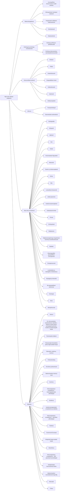

# High-Value Dataset Categories
## Language code: **et**

```mermaid
flowchart LR
http://data.europa.eu/bna/asd487ae75[High-value dataset categories]
click http://data.europa.eu/bna/asd487ae75 href "http://data.europa.eu/bna/asd487ae75"
http://data.europa.eu/bna/asd487ae75-->http://data.europa.eu/bna/c_164e0bf5
http://data.europa.eu/bna/c_164e0bf5["Meteoroloogiateave"]
click http://data.europa.eu/bna/c_164e0bf5 href "http://data.europa.eu/bna/c_164e0bf5"
http://data.europa.eu/bna/c_164e0bf5-->http://data.europa.eu/bna/c_13e3cf16
http://data.europa.eu/bna/c_13e3cf16["Arvutuspõhise ilmaennustuse mudeli andmed"]
click http://data.europa.eu/bna/c_13e3cf16 href "http://data.europa.eu/bna/c_13e3cf16"
http://data.europa.eu/bna/c_164e0bf5-->http://data.europa.eu/bna/c_36807466
http://data.europa.eu/bna/c_36807466["Kliimaandmed: kinnitatud vaatlused"]
click http://data.europa.eu/bna/c_36807466 href "http://data.europa.eu/bna/c_36807466"
http://data.europa.eu/bna/c_164e0bf5-->http://data.europa.eu/bna/c_3af3368c
http://data.europa.eu/bna/c_3af3368c["Ilmajaamade mõõdetud vaatlusandmed"]
click http://data.europa.eu/bna/c_3af3368c href "http://data.europa.eu/bna/c_3af3368c"
http://data.europa.eu/bna/c_164e0bf5-->http://data.europa.eu/bna/c_be47b010
http://data.europa.eu/bna/c_be47b010["Ilmahoiatused"]
click http://data.europa.eu/bna/c_be47b010 href "http://data.europa.eu/bna/c_be47b010"
http://data.europa.eu/bna/c_164e0bf5-->http://data.europa.eu/bna/c_d13a4420
http://data.europa.eu/bna/c_d13a4420["Radariandmed"]
click http://data.europa.eu/bna/c_d13a4420 href "http://data.europa.eu/bna/c_d13a4420"
http://data.europa.eu/bna/asd487ae75-->http://data.europa.eu/bna/c_a9135398
http://data.europa.eu/bna/c_a9135398["Äriühingud ja äriühingu omandisuhted"]
click http://data.europa.eu/bna/c_a9135398 href "http://data.europa.eu/bna/c_a9135398"
http://data.europa.eu/bna/c_a9135398-->http://data.europa.eu/bna/c_56a1bf47
http://data.europa.eu/bna/c_56a1bf47["Äriühingu põhiteave: põhiatribuudid"]
click http://data.europa.eu/bna/c_56a1bf47 href "http://data.europa.eu/bna/c_56a1bf47"
http://data.europa.eu/bna/c_a9135398-->http://data.europa.eu/bna/c_8f0fac04
http://data.europa.eu/bna/c_8f0fac04["Äriühingu dokumendid ja raamatupidamisaruanded"]
click http://data.europa.eu/bna/c_8f0fac04 href "http://data.europa.eu/bna/c_8f0fac04"
http://data.europa.eu/bna/asd487ae75-->http://data.europa.eu/bna/c_ac64a52d
http://data.europa.eu/bna/c_ac64a52d["Georuumilised andmed"]
click http://data.europa.eu/bna/c_ac64a52d href "http://data.europa.eu/bna/c_ac64a52d"
http://data.europa.eu/bna/c_ac64a52d-->http://data.europa.eu/bna/c_60182062
http://data.europa.eu/bna/c_60182062["Ehitised"]
click http://data.europa.eu/bna/c_60182062 href "http://data.europa.eu/bna/c_60182062"
http://data.europa.eu/bna/c_ac64a52d-->http://data.europa.eu/bna/c_642643e6
http://data.europa.eu/bna/c_642643e6["Põllud"]
click http://data.europa.eu/bna/c_642643e6 href "http://data.europa.eu/bna/c_642643e6"
http://data.europa.eu/bna/c_ac64a52d-->http://data.europa.eu/bna/c_6a3f6896
http://data.europa.eu/bna/c_6a3f6896["Katastriüksused"]
click http://data.europa.eu/bna/c_6a3f6896 href "http://data.europa.eu/bna/c_6a3f6896"
http://data.europa.eu/bna/c_ac64a52d-->http://data.europa.eu/bna/c_6c2bb82d
http://data.europa.eu/bna/c_6c2bb82d["Geograafilised nimed"]
click http://data.europa.eu/bna/c_6c2bb82d href "http://data.europa.eu/bna/c_6c2bb82d"
http://data.europa.eu/bna/c_ac64a52d-->http://data.europa.eu/bna/c_9427236f
http://data.europa.eu/bna/c_9427236f["Haldusüksused"]
click http://data.europa.eu/bna/c_9427236f href "http://data.europa.eu/bna/c_9427236f"
http://data.europa.eu/bna/c_ac64a52d-->http://data.europa.eu/bna/c_c3de25e4
http://data.europa.eu/bna/c_c3de25e4["Aadressid"]
click http://data.europa.eu/bna/c_c3de25e4 href "http://data.europa.eu/bna/c_c3de25e4"
http://data.europa.eu/bna/c_ac64a52d-->http://data.europa.eu/bna/c_fbd2fc3f
http://data.europa.eu/bna/c_fbd2fc3f["Võrdlusmaatükid"]
click http://data.europa.eu/bna/c_fbd2fc3f href "http://data.europa.eu/bna/c_fbd2fc3f"
http://data.europa.eu/bna/asd487ae75-->http://data.europa.eu/bna/c_b79e35eb
http://data.europa.eu/bna/c_b79e35eb["Liikuvus"]
click http://data.europa.eu/bna/c_b79e35eb href "http://data.europa.eu/bna/c_b79e35eb"
http://data.europa.eu/bna/c_b79e35eb-->http://data.europa.eu/bna/c_4b74ea13
http://data.europa.eu/bna/c_4b74ea13["Transpordivõrgud"]
click http://data.europa.eu/bna/c_4b74ea13 href "http://data.europa.eu/bna/c_4b74ea13"
http://data.europa.eu/bna/c_b79e35eb-->http://data.europa.eu/bna/c_b151a0ba
http://data.europa.eu/bna/c_b151a0ba["Siseveeteede andmestikud"]
click http://data.europa.eu/bna/c_b151a0ba href "http://data.europa.eu/bna/c_b151a0ba"
http://data.europa.eu/bna/asd487ae75-->http://data.europa.eu/bna/c_dd313021
http://data.europa.eu/bna/c_dd313021["Maa seire ja keskkond"]
click http://data.europa.eu/bna/c_dd313021 href "http://data.europa.eu/bna/c_dd313021"
http://data.europa.eu/bna/c_dd313021-->http://data.europa.eu/bna/c_06b1eec4
http://data.europa.eu/bna/c_06b1eec4["Hüdrograafia"]
click http://data.europa.eu/bna/c_06b1eec4 href "http://data.europa.eu/bna/c_06b1eec4"
http://data.europa.eu/bna/c_dd313021-->http://data.europa.eu/bna/c_315692ad
http://data.europa.eu/bna/c_315692ad["Kõrgused"]
click http://data.europa.eu/bna/c_315692ad href "http://data.europa.eu/bna/c_315692ad"
http://data.europa.eu/bna/c_dd313021-->http://data.europa.eu/bna/c_38933a65
http://data.europa.eu/bna/c_38933a65["Jäätmed"]
click http://data.europa.eu/bna/c_38933a65 href "http://data.europa.eu/bna/c_38933a65"
http://data.europa.eu/bna/c_dd313021-->http://data.europa.eu/bna/c_43f88346
http://data.europa.eu/bna/c_43f88346["Vesi"]
click http://data.europa.eu/bna/c_43f88346 href "http://data.europa.eu/bna/c_43f88346"
http://data.europa.eu/bna/c_dd313021-->http://data.europa.eu/bna/c_4ba9548e
http://data.europa.eu/bna/c_4ba9548e["Heited"]
click http://data.europa.eu/bna/c_4ba9548e href "http://data.europa.eu/bna/c_4ba9548e"
http://data.europa.eu/bna/c_dd313021-->http://data.europa.eu/bna/c_4d63300b
http://data.europa.eu/bna/c_4d63300b["Horisontaalsed õigusaktid"]
click http://data.europa.eu/bna/c_4d63300b href "http://data.europa.eu/bna/c_4d63300b"
http://data.europa.eu/bna/c_dd313021-->http://data.europa.eu/bna/c_4dd389c5
http://data.europa.eu/bna/c_4dd389c5["Maavarad"]
click http://data.europa.eu/bna/c_4dd389c5 href "http://data.europa.eu/bna/c_4dd389c5"
http://data.europa.eu/bna/c_dd313021-->http://data.europa.eu/bna/c_59c93ba5
http://data.europa.eu/bna/c_59c93ba5["Tootmis- ja tööstusrajatised"]
click http://data.europa.eu/bna/c_59c93ba5 href "http://data.europa.eu/bna/c_59c93ba5"
http://data.europa.eu/bna/c_dd313021-->http://data.europa.eu/bna/c_59e64dd4
http://data.europa.eu/bna/c_59e64dd4["Kliima"]
click http://data.europa.eu/bna/c_59e64dd4 href "http://data.europa.eu/bna/c_59e64dd4"
http://data.europa.eu/bna/c_dd313021-->http://data.europa.eu/bna/c_63b37dd4
http://data.europa.eu/bna/c_63b37dd4["Õhk"]
click http://data.europa.eu/bna/c_63b37dd4 href "http://data.europa.eu/bna/c_63b37dd4"
http://data.europa.eu/bna/c_dd313021-->http://data.europa.eu/bna/c_63be22bd
http://data.europa.eu/bna/c_63be22bd["Looduslikud ohutsoonid"]
click http://data.europa.eu/bna/c_63be22bd href "http://data.europa.eu/bna/c_63be22bd"
http://data.europa.eu/bna/c_dd313021-->http://data.europa.eu/bna/c_793164b6
http://data.europa.eu/bna/c_793164b6["Liikide jaotumine"]
click http://data.europa.eu/bna/c_793164b6 href "http://data.europa.eu/bna/c_793164b6"
http://data.europa.eu/bna/c_dd313021-->http://data.europa.eu/bna/c_7b8fbb64
http://data.europa.eu/bna/c_7b8fbb64["Keskkonnaseirerajatised"]
click http://data.europa.eu/bna/c_7b8fbb64 href "http://data.europa.eu/bna/c_7b8fbb64"
http://data.europa.eu/bna/c_dd313021-->http://data.europa.eu/bna/c_83aa10a6
http://data.europa.eu/bna/c_83aa10a6["Kaitsealused kohad"]
click http://data.europa.eu/bna/c_83aa10a6 href "http://data.europa.eu/bna/c_83aa10a6"
http://data.europa.eu/bna/c_dd313021-->http://data.europa.eu/bna/c_87a129d9
http://data.europa.eu/bna/c_87a129d9["Pinnas"]
click http://data.europa.eu/bna/c_87a129d9 href "http://data.europa.eu/bna/c_87a129d9"
http://data.europa.eu/bna/c_dd313021-->http://data.europa.eu/bna/c_91185a85
http://data.europa.eu/bna/c_91185a85["Ortokujutised"]
click http://data.europa.eu/bna/c_91185a85 href "http://data.europa.eu/bna/c_91185a85"
http://data.europa.eu/bna/c_dd313021-->http://data.europa.eu/bna/c_ad9ae929
http://data.europa.eu/bna/c_ad9ae929["Maakasutus"]
click http://data.europa.eu/bna/c_ad9ae929 href "http://data.europa.eu/bna/c_ad9ae929"
http://data.europa.eu/bna/c_dd313021-->http://data.europa.eu/bna/c_af646f5b
http://data.europa.eu/bna/c_af646f5b["Üldplaneering/piirangu-/reguleeritud tsoonid ja aruandlusüksused"]
click http://data.europa.eu/bna/c_af646f5b href "http://data.europa.eu/bna/c_af646f5b"
http://data.europa.eu/bna/c_dd313021-->http://data.europa.eu/bna/c_b21e1296
http://data.europa.eu/bna/c_b21e1296["Maakate"]
click http://data.europa.eu/bna/c_b21e1296 href "http://data.europa.eu/bna/c_b21e1296"
http://data.europa.eu/bna/c_dd313021-->http://data.europa.eu/bna/c_b40e6d46
http://data.europa.eu/bna/c_b40e6d46["Okeanograafilis-geograafilised tunnusjooned"]
click http://data.europa.eu/bna/c_b40e6d46 href "http://data.europa.eu/bna/c_b40e6d46"
http://data.europa.eu/bna/c_dd313021-->http://data.europa.eu/bna/c_b7de66cd
http://data.europa.eu/bna/c_b7de66cd["Energiaressursid"]
click http://data.europa.eu/bna/c_b7de66cd href "http://data.europa.eu/bna/c_b7de66cd"
http://data.europa.eu/bna/c_dd313021-->http://data.europa.eu/bna/c_b7f6a4f3
http://data.europa.eu/bna/c_b7f6a4f3["Looduskaitse ja bioloogiline mitmekesisus"]
click http://data.europa.eu/bna/c_b7f6a4f3 href "http://data.europa.eu/bna/c_b7f6a4f3"
http://data.europa.eu/bna/c_dd313021-->http://data.europa.eu/bna/c_c3919aec
http://data.europa.eu/bna/c_c3919aec["Elupaigad ja biotoobid"]
click http://data.europa.eu/bna/c_c3919aec href "http://data.europa.eu/bna/c_c3919aec"
http://data.europa.eu/bna/c_dd313021-->http://data.europa.eu/bna/c_c873f344
http://data.europa.eu/bna/c_c873f344["Bio-geograafilised piirkonnad"]
click http://data.europa.eu/bna/c_c873f344 href "http://data.europa.eu/bna/c_c873f344"
http://data.europa.eu/bna/c_dd313021-->http://data.europa.eu/bna/c_e3f55603
http://data.europa.eu/bna/c_e3f55603["Geoloogia"]
click http://data.europa.eu/bna/c_e3f55603 href "http://data.europa.eu/bna/c_e3f55603"
http://data.europa.eu/bna/c_dd313021-->http://data.europa.eu/bna/c_e4358335
http://data.europa.eu/bna/c_e4358335["Müra"]
click http://data.europa.eu/bna/c_e4358335 href "http://data.europa.eu/bna/c_e4358335"
http://data.europa.eu/bna/c_dd313021-->http://data.europa.eu/bna/c_f399050e
http://data.europa.eu/bna/c_f399050e["Merepiirkonnad"]
click http://data.europa.eu/bna/c_f399050e href "http://data.europa.eu/bna/c_f399050e"
http://data.europa.eu/bna/asd487ae75-->http://data.europa.eu/bna/c_e1da4e07
http://data.europa.eu/bna/c_e1da4e07["Statistika"]
click http://data.europa.eu/bna/c_e1da4e07 href "http://data.europa.eu/bna/c_e1da4e07"
http://data.europa.eu/bna/c_e1da4e07-->http://data.europa.eu/bna/c_04bf94a3
http://data.europa.eu/bna/c_04bf94a3["Vaesus"]
click http://data.europa.eu/bna/c_04bf94a3 href "http://data.europa.eu/bna/c_04bf94a3"
http://data.europa.eu/bna/c_e1da4e07-->http://data.europa.eu/bna/c_20cd11bb
http://data.europa.eu/bna/c_20cd11bb["ELi rahvusvahelise kaubavahetuse statistika – eksport ja import jaotus samaaegselt partnerite, toodete ja kaubavoogude kaupa"]
click http://data.europa.eu/bna/c_20cd11bb href "http://data.europa.eu/bna/c_20cd11bb"
http://data.europa.eu/bna/c_e1da4e07-->http://data.europa.eu/bna/c_23385471
http://data.europa.eu/bna/c_23385471["Potentsiaalne tööjõud"]
click http://data.europa.eu/bna/c_23385471 href "http://data.europa.eu/bna/c_23385471"
http://data.europa.eu/bna/c_e1da4e07-->http://data.europa.eu/bna/c_2aed31f9
http://data.europa.eu/bna/c_2aed31f9["Tööstustootja hinnaindeksi jaotus tegevusalade kaupa"]
click http://data.europa.eu/bna/c_2aed31f9 href "http://data.europa.eu/bna/c_2aed31f9"
http://data.europa.eu/bna/c_e1da4e07-->http://data.europa.eu/bna/c_317b9493
http://data.europa.eu/bna/c_317b9493["Rahvastik, sündimus, suremus"]
click http://data.europa.eu/bna/c_317b9493 href "http://data.europa.eu/bna/c_317b9493"
http://data.europa.eu/bna/c_e1da4e07-->http://data.europa.eu/bna/c_34abf8c1
http://data.europa.eu/bna/c_34abf8c1["Tööstustoodang"]
click http://data.europa.eu/bna/c_34abf8c1 href "http://data.europa.eu/bna/c_34abf8c1"
http://data.europa.eu/bna/c_e1da4e07-->http://data.europa.eu/bna/c_424bb0b4
http://data.europa.eu/bna/c_424bb0b4["Tervishoiu jooksevkulud"]
click http://data.europa.eu/bna/c_424bb0b4 href "http://data.europa.eu/bna/c_424bb0b4"
http://data.europa.eu/bna/c_e1da4e07-->http://data.europa.eu/bna/c_4ac557e7
http://data.europa.eu/bna/c_4ac557e7["Valitsemissektori kulud ja tulud"]
click http://data.europa.eu/bna/c_4ac557e7 href "http://data.europa.eu/bna/c_4ac557e7"
http://data.europa.eu/bna/c_e1da4e07-->http://data.europa.eu/bna/c_4acb6bf3
http://data.europa.eu/bna/c_4acb6bf3["Suremus"]
click http://data.europa.eu/bna/c_4acb6bf3 href "http://data.europa.eu/bna/c_4acb6bf3"
http://data.europa.eu/bna/c_e1da4e07-->http://data.europa.eu/bna/c_59627af3
http://data.europa.eu/bna/c_59627af3["Rahvamajanduse arvepidamine – kodumajapidamiste põhinäitajad"]
click http://data.europa.eu/bna/c_59627af3 href "http://data.europa.eu/bna/c_59627af3"
http://data.europa.eu/bna/c_e1da4e07-->http://data.europa.eu/bna/c_6a7250c1
http://data.europa.eu/bna/c_6a7250c1["Sündimus"]
click http://data.europa.eu/bna/c_6a7250c1 href "http://data.europa.eu/bna/c_6a7250c1"
http://data.europa.eu/bna/c_e1da4e07-->http://data.europa.eu/bna/c_92874eb2
http://data.europa.eu/bna/c_92874eb2["Keskkonnamajanduslik arvepidamine ja statistika"]
click http://data.europa.eu/bna/c_92874eb2 href "http://data.europa.eu/bna/c_92874eb2"
http://data.europa.eu/bna/c_e1da4e07-->http://data.europa.eu/bna/c_95da87c7
http://data.europa.eu/bna/c_95da87c7["Rahvamajanduse arvepidamine – ettevõtete põhinäitajad"]
click http://data.europa.eu/bna/c_95da87c7 href "http://data.europa.eu/bna/c_95da87c7"
http://data.europa.eu/bna/c_e1da4e07-->http://data.europa.eu/bna/c_a2c6dcd8
http://data.europa.eu/bna/c_a2c6dcd8["Tööhõive"]
click http://data.europa.eu/bna/c_a2c6dcd8 href "http://data.europa.eu/bna/c_a2c6dcd8"
http://data.europa.eu/bna/c_e1da4e07-->http://data.europa.eu/bna/c_a3767648
http://data.europa.eu/bna/c_a3767648["Turismivood Euroopas"]
click http://data.europa.eu/bna/c_a3767648 href "http://data.europa.eu/bna/c_a3767648"
http://data.europa.eu/bna/c_e1da4e07-->http://data.europa.eu/bna/c_a49ec591
http://data.europa.eu/bna/c_a49ec591["Müügimaht tegevusalade kaupa"]
click http://data.europa.eu/bna/c_a49ec591 href "http://data.europa.eu/bna/c_a49ec591"
http://data.europa.eu/bna/c_e1da4e07-->http://data.europa.eu/bna/c_a8b937c4
http://data.europa.eu/bna/c_a8b937c4["Ebavõrdsus"]
click http://data.europa.eu/bna/c_a8b937c4 href "http://data.europa.eu/bna/c_a8b937c4"
http://data.europa.eu/bna/c_e1da4e07-->http://data.europa.eu/bna/c_b72b721f
http://data.europa.eu/bna/c_b72b721f["Rahvamajanduse arvepidamine – SKP peamised koondnäitajad"]
click http://data.europa.eu/bna/c_b72b721f href "http://data.europa.eu/bna/c_b72b721f"
http://data.europa.eu/bna/c_e1da4e07-->http://data.europa.eu/bna/c_c0022235
http://data.europa.eu/bna/c_c0022235["Tarbijahindade harmoneeritud indeks"]
click http://data.europa.eu/bna/c_c0022235 href "http://data.europa.eu/bna/c_c0022235"
http://data.europa.eu/bna/c_e1da4e07-->http://data.europa.eu/bna/c_dd8f4797
http://data.europa.eu/bna/c_dd8f4797["Valitsemissektori konsolideeritud koguvõlg"]
click http://data.europa.eu/bna/c_dd8f4797 href "http://data.europa.eu/bna/c_dd8f4797"
http://data.europa.eu/bna/c_e1da4e07-->http://data.europa.eu/bna/c_f2b50efd
http://data.europa.eu/bna/c_f2b50efd["Rahvastik"]
click http://data.europa.eu/bna/c_f2b50efd href "http://data.europa.eu/bna/c_f2b50efd"
http://data.europa.eu/bna/c_e1da4e07-->http://data.europa.eu/bna/c_fd4e881c
http://data.europa.eu/bna/c_fd4e881c["Töötus"]
click http://data.europa.eu/bna/c_fd4e881c href "http://data.europa.eu/bna/c_fd4e881c"
```
